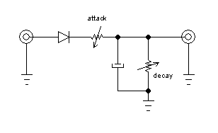
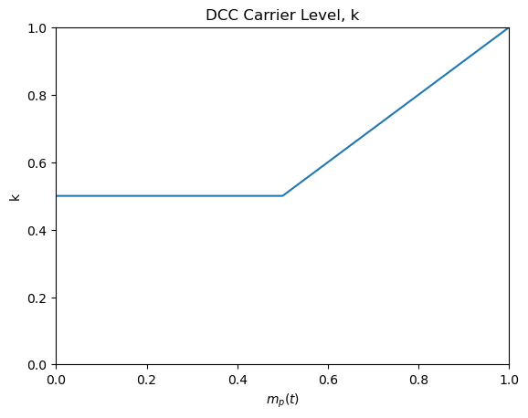
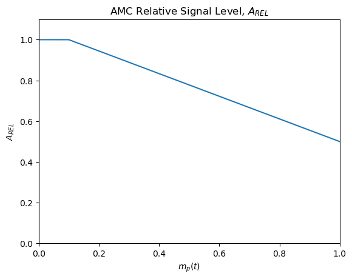
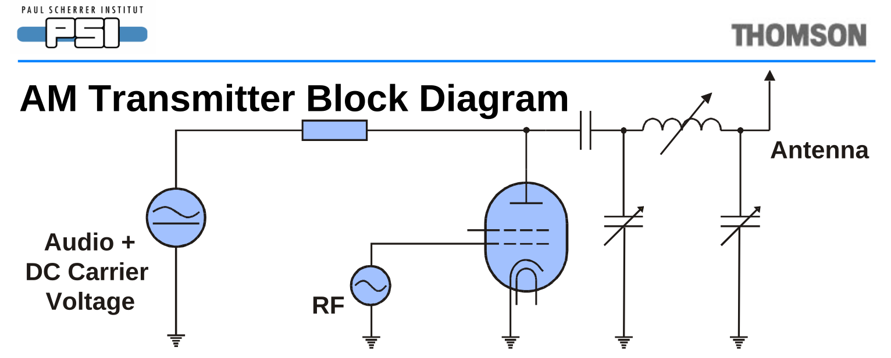
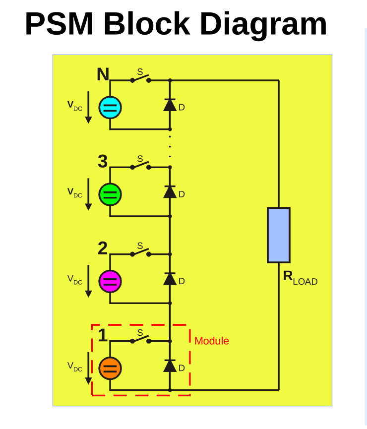
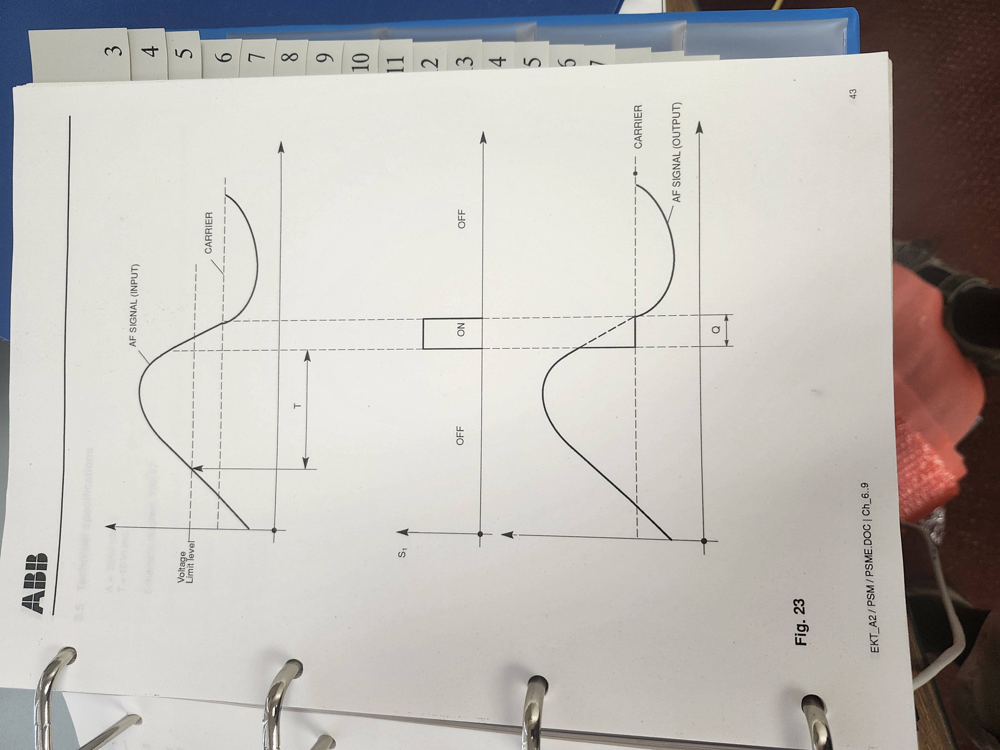

# AWR MDCL Board
The YSE50 Amplitude Modulation Compandor (AMC) board for the ABB (ASEA Brown Bovari) SK-52 transmitters was redesigned  at AWR because we wanted a way to automatically reduce the transmitter power in real-time based on signal-to-noise ratio measurements in the target area.  It also provides us an opportunity to change the modulation-dependent carrier level (MDCL) automatically in real-time, based on the program content and/or the signal-to-noise ratio in the target area.  

This design should work with any transmitter using an ABB PSM (pulse step modulator) for AM or SW broadcasting designed in the 1980s or 1990s. It replaces the YSE 50 or YSE 21 PCBs in the PSM.  I suspect it should work with any transmitter using the YSE 21 or YSE 50.  These boards cost around \\$90,000 around the turn of the century, but you should be able to build this one for about $150 each in 2024, the most expensive parts are the DIN connectors that mate the board to the transmitter.  These boards are far better, because they use software to do the MDCL and facilitate experimentation and optimization.

## MDCL
Adventist World Radio (AWR) on Guam uses modulation-dependent carrier level (MDCL) which is a way of modifying the transmitted AM signal so it uses less power than standard amplitude modulation while hopefully not reducing the listenership.  AM was designed so receivers could be built easily and inexpensively using the technology available in the early 20th century.  A sinusoid at the radio frequency would be modulated (have its amplitude adjusted) as the desired audio signal, $m(t)$, went up and down.  If the radio frequency (RF) sine wave was $A cos(\omega_c t)$ and the audio signal to be transmitted was $m(t)$ where $|m(t)| < 1$, the transmitted signal, $v(t)$ is given by $A(1+m(t))cos(\omega_c t)$. Keeping the magnitude of the audio signal less than one makes $m(t)$ easy to remove from $v(t)$ with an envelope detector enabling very simple receivers to be constructed.  Unfortunately, there is no information in the $1$ term of $(1 + m(t))$, but it does take energy to send it.  If the audio is very soft so that $m(t) << 1$, and the goal is to transmit the information in $m(t)$, it seems especially wasteful.  (Note: Even a public address system playing an analog audio signal like $m(t)$ isn't an equal cost per bit of information.  Loud signals require more power, but they don't always contain more information.  Sometimes the quiet whisper of a friend is worth far more than the loud talk going on.  But for AM modulation the $1$ term has almost nothing to do with the $m(t)$, so it indeed seems a waste to send, at least in a certain sense.)

There are two different types of MDCL, Dynamic Carrier Control (DCC) and Amplitude Modulation Companding (AMC).  

### DCC
DCC reduces the $1$ term in $1 + m(t)$, so less carrier power is transmitted when less is needed, keeping the percentage modulation closer to 100% where the peaks of $m(t) = 1$.   The  DCC signal would be $v_{DCC}(t) = A(k(t)+m(t))cos(\omega_c t)$ .  Because the factor $k < 1$ DCC saves some energy that would have been sent in the carrier perhaps unnecessarily.  It is a slowly varying function of time compared to $m(t)$, so we often think of it as a constant, just $k$. Suppose $k$ was reduced to zero when $m(t) = 0$, then other interfering signals would likely be heard by the receiver instead of silence because most receivers have automatic gain control (AGC) which adjusts the gain up when the signal goes down.  To combat this, $k$ is not usually reduced all the way down to zero.  This leaves a flat carrier for silence, which is usually strong enough that the small noise will be masked out and the receiver will produce silence.

All MDCL schemes use a fast attack slow decay signal based on the absolute value of the modulation signal.  If $m(t)$ quickly gets louder, the changes we make to the RF signal need to respond quickly, but if $m(t)$ decreases in amplitude we should respond slowly to minimize artifacts of our signal processing.  So the first step in doing MDCL is to construct this signal.  We call this signal $m_p(t) = f(|m(t)|)$ where $f$ is the fast attack, slow decay function of time.  In the old analog days, a circuit like this where the capacitor is charged based on the $R_{attack} C$ time-constant and decays based on the $R_{decay} C$ time-constant.  (Rob, replace this figure when you get your tablet-PC going again.)


would have been used.

Below, you can see how $k$ is computed as a function of $m_p(t)$ for DCC.  This function is somewhat heuristic.  The one shown is used in the YSE21 board.  Sometimes $k$ goes back up for low values of $m_p(t)$ to help silence be silent in a real receiver in the presence of interference.


```python
import matplotlib.pyplot as plt
import numpy as np

# Define the x values
x = np.linspace(0, 1, 500)

# Define the y values based on the condition
y = np.piecewise(x, [x < 0.5, x >= 0.5], [0.5, lambda x: (x-0.5)+0.5])

# Create the plot
plt.plot(x, y)

# Label the axes
plt.xlabel('$m_p(t)$')
plt.ylabel('k')

# Set the range for the axes
plt.xlim(0, 1)
plt.ylim(0, 1)

plt.title('DCC Carrier Level, k')

# Display the plot
plt.show()
```


    

    


### AMC
AMC takes the view that the soft or silent portions of the broadcast are more important to preserve than the loud portions.  This may be more appropriate for music rather than talk.  It adjusts the amplitude of $v(t)$, instead of just the carrier, as a function of $m_p(t)$ so  $v_{AMC} = A (A_{REL}(1+m(t)))$.  The following graph shows $A_{REL}$ as a function of $m_p(t)$.  Note again, that makes $A_{REL}$ a function of $t$, but since it is relatively slowly varying compared with $m(t)$, so we just call it $A_{REL}$.  


```python
# Define the x values
x = np.linspace(0, 1, 500)

# Define the y values based on the condition
y = np.piecewise(x, [x < 0.1, x >= 0.1], [1, lambda x: (-0.5/.9*x+1+.1*.5/.9)])

# Create the plot
plt.plot(x, y)

# Label the axes
plt.xlabel('$m_p(t)$')
plt.ylabel('$A_{REL}$')

# Set the range for the axes
plt.xlim(0, 1)
plt.ylim(0, 1.1)

plt.title('AMC Relative Signal Level, $A_{REL}$')

# Display the plot
plt.show()
```


    

    


AMC peak output power of the transmitter is the same as the output from the carrier alone.  For example, an SK-52 transmitter with a normal AM power level specified at 100 kW, means the carrier alone will output 100 kW average power.  On peak modulation, the output will be 400 kW because the $m(t)$ adds to the $1$ to become $2$ for 100% modulation at peaks of $m(t)$ giving $4$ times the power because power is proportional to the square of the voltage which is twice what it was for the carrier alone.  AMC thus saves power and wear and tear on the transmitter, by reducing the average power it is transmitting under larger modulation.  

There are variations on these two themes of MDCL one can dream about.  It is claimed that AMC is better for music, while DCC is better for speech.  AMC is more popular with medium wave AM stations.  It may sound better at least to some.  DCC only reduces carrier power, and that really doesn't contain any information other than silence.  Previous experiments with DCC indicated it actually sounds louder to the listener due to the way the receiver AGC and the transmitter DCC interact which is good for short wave.  AMC will save the station more money than DCC, but so would simply turning the power down.  Turning the power down is the major improvement we wish to add to the options, so we can use AMC, DCC, or ordinary AM, but only the power needed.  In the past it was not easy to measure how much power was needed, but now with Internet connected receivers, it can be done fairly easily.  Since the space weather changes the signal levels for skywave signals, this will change over time, so there will be times when less power is needed than the maximum possible.  In general a cut in power by half is only barely perceptible to the listener, so significant savings on the power bill can be expected.  The plan is to measure the signal-to-noise ratio every 15 minutes or so and change the transmitter power as appropriate.

## Transmitter Operation
AWR Guam has five ABB SK-52 100 kW transmitters.  They use the standard modulation method, where the B+ high voltage on the plate of the final amplifiers is supplied by the modulator, which produces an amplified version of the output of the MDCL output signal.  By varying this voltage on the plate of the final RF amplifier, the output signal’s amplitude is set.  This is called modulating the transmitter.   See the diagram below.


A Pulse Step Modulator (PSM) is used to create the “Audio + DC Carrier Voltage” in the diagram above.  The PSM is essentially like a digital to analog converter where 26 voltage sources are switched in series by digital signals.  It is like a 26 level digital to analog converter with an output of 22 kV maximum.  When the AM transmitter (no MDCL) is sending silence, the PSM puts out 11 kV.  At 100% modulation where the $max (|m(t)|) = 1$, it puts out between 0 and 22 kV as the audio, $m(t)$ goes up and down.  Below is a basic diagram of a PSM.  The switches are controlled digitally and in the SK-52 are gate turn off (GTO) devices.  The blue, green, magenta and orange circular symbols are voltage sources.  (Rob, to avoid copyright, we could replace these when you have your bricked computer back.)


The most obvious place in the circuit to incorporate a modification to the SK-52 transmitters is in the MDCL board, so YS50 was replaced.  The MDCL board is where something can be incorporated into the circuit to lower the power when a remote Internet connected receiver in the target area indicates the transmitter could cut power without significantly lowering the number of listeners.  We just add one more parameter we can control that multiplies whatever type of audio signal we have by a slowly varying "constant", that changes perhaps every 15 minutes as the signal-to-noise ratio is updated.  If this constant is called $A_{att}$, it would have a maximum value of $1$ for maximum power, and $0.707$ for half power, or $0.5$ for quarter power.  

Note in the blue AM Transmitter Block Diagram above, the screen grid in the vacuum tube.  Unless the voltage on the screen is also controlled by the MDCL board, a risk exists that the screen current will increase beyond acceptable limits.  For example if the plate of the tube is at $0$ volts, and the screen at a higher voltage, the screen will act as the plate normally would and the screen current would be way to high.  This means there is a limit to how much we can drop $A_{att}$.  A solution to this problem is to increase the resistor between the screen supply and the screen.  We were able to drop the power to 25% of maximum.  (Rob, make sure this is correct.)

We also noted a problem with the PSM protection circuitry which styll needs to be ironed out.

The transmitter has a limit to how long the modulation, $m(t)$ can exceed a certain value, so that the transmitter is not operated beyond 100 kW for longer than is good for it.  This limit is enforced in the MDCL software as well.

## Board Description

### Hardware
The hardware is based on a [PJRC Teensy 4.1 development board](https://www.pjrc.com/store/teensy41.html).  It features a 600 MHz ARM Cortex-M7 processor with FPU, nice Arduino DSP library, a USB 2.0 port and Ethernet.  The data $1+m(t)$ comes in as a 5V TTL digital 12-bit parallel signal sampled at 100 kHz.  This signal is converted to a serial signal by a pair of 74LV165 parallel to serial conversion ICs.  These also convert the 5V TTL level signals of the input data to 3.3 V logic levels.  This serial data is read into the Teensy using SPI0.  The Teensy processes the signal as needed and sends the data to a serial to parallel conversion performed by a pair of 74ACHT595 ICs, which send the result on to the next board in the transmitter.  There is a CH340G that allows use of a second USB serial port for debugging (Serial2 for the Arduino) and four connectors for the inexpensive eight bit logic analyzers from China to read the serial and parallel data.  There are a number of LEDs for indicators and debugging and some provision for connecting other signals to the Teensy in case we overlooked something.  The Teensy we are using comes with Ethernet, and we send the real-time control signals over that medium.

The Teensy has a feature that may eventually be used to eliminate the analog stages of the whole broadcast system, making the whole system at KSDA digital, from the digital audio in all the way to the PSM of the transmitter.  This feature is the USB connector on the Teensy can be made to look just like a USB sound card for a computer operating at the 44.1 kHz sample rate. I have tested the Linux sample rate conversion library runing a sinc interpolator and it looks feasible to convert from 44.1 kHz to 100 kHz in real time, leaving about half the time between 100 kHz samples for DSP.  Optical USB extenders can be used to span the distance between the transmitters and the audio distribution computer.

### Software

#### Toolchain
You can build this with the Arduino IDE using Teensyduino or with VScode.  The latter gives you a nicer environment, but the former is quicker to set up.

#### Serial Input
The SPI (SPI0) is used for the serial data transfer of the input data.  The upper four bits of the 16 bit word should be zero.  If not, you have RFI or something bad happening.  The Teensy 4.1 supports a depreciated legacy way or doing the transactions, but also has the new recommend way.  Using that method, the speed can be increased from 12 MHz to 80 MHz.  The setup function shows how to set things up, and the ISR is shown below:
// ISR function called by the interrupt that is triggered by L1
// to process the new word from the transmitter
void receive2ByteWord() // Receive 16-bit word from SPI0
{                       // Select the slave device
  SPI.beginTransaction(spiSettings);
  digitalWrite(chipSelectPin0, LOW);
  // Send a dummy byte to initiate the SPI read and receive the 16-bit word
  uint16_t dummy = 0x00;
  receivedWord = SPI.transfer16(dummy); // Deselect the slave device
  digitalWrite(chipSelectPin0, HIGH);
  validWord = 1; // Indicates that the new 16-bit word is received and ready to process
  SPI.endTransaction();
}
#### Serial Output
The SPI1 bus is used for transferring data to the serial to parallel converter so the data will be ready for a parallel read by the transmitter.  Like the serial input, the setup function gets the SPI initialized and the following code is the ISR that happens when triggered by LC.
// ISR function called by the interrupt that is triggered by L5 to send the
// processed word to the transmitter (DCC board used LC, but L5 is faster)
void send2ByteWord()
{
  SPI1.beginTransaction(spiSettings);

  digitalWrite(chipSelectPin1, LOW); //  We are not using CS1.
  SPI1.transfer16(wordToSend);       // Send the 16-bit word to the transmitter
  digitalWrite(chipSelectPin1, HIGH);
  SPI1.endTransaction();
}
DCC and MDCL Processing
uint16_t processMDCL(uint16_t one_plus_m_t)
// See the MDCL.ipynb for the theory on this.
{ // This function takes a 16-bit word whose lower 12 bits is 1+m(t) and processes it according to the MDCL algorithm
  // We could put a check for overmodulation here if wanted (Check for repeated 0's)
  if (digitalRead(SSBOnOffPin) == LOW && digitalRead(NFBereitPin) == HIGH && digitalRead(DCCOnOffPin) == HIGH)
  { // if MCDL is on
    uint16_t m_p;
    static uint16_t m_pPrevious = 0;     // store the previous m_p(t) value
    static uint16_t samplesUntilDecay = samplesPerDecay; // This is the number of samples until the decay starts

    if (one_plus_m_t < 2048)           // Find |m(t)| value where 1 + m(t) scaled to 0 to 4095
    {
      m_p = 2048 - one_plus_m_t; // This should not overflow.
    }
    else
    {
      m_p = one_plus_m_t - 2048; // This should not overflow.
    }
    #ifdef DEBUG
    uint16_t m_p_a;
    m_p_a = m_p;  // mpa is for debugging.  It is m_p without the decay.
    #endif
    // m_p(t) needs to be a fast attack, slow decay function of time
    if (m_p <= m_pPrevious) // m_p is decreasing
    { 
      m_p = m_pPrevious; // m_p(t) should not decrease
      if (samplesUntilDecay > 0) // Will decay down to close to 0 (within samplesPerDecay) if m_p(t) is not increasing
      {
        samplesUntilDecay--;
      }
      else // sammples until decay is 0, so decay one step
      {
        if (m_p > 0) m_p--; // m_p should not be decreased below zero
        samplesUntilDecay = samplesPerDecay; // Reset the decay counter
      }
    }
    else // m_p in increasing so don't decay m_p(t).  It needs to rise instantly, but samplesPerDecay needs to be reset so it is ready for the next decay.
    {
      samplesUntilDecay = samplesPerDecay; // Reset the decay counter
    }
    m_pPrevious = m_p; // Store the current m_p(t) value for the next cycle
    if (currentMDCLNumber == 0) // DCC
    {
      if (digitalRead(DCCPin) != HIGH) // Change indicator LEDs if needed
      {
        digitalWrite(DCCPin, HIGH);
        digitalWrite(AMCPin, LOW);
      }
      uint16_t dccK; // See the graph of DCC k as a function of m_p(t).  We may want to pass the 430 and 1024 parameters in someday
      if (m_p > 1024)
      {
        dccK = m_p;
      }
      else if (m_p < 430) // Using curve as used for ABB high power transmitters (> 100 kW)
      {
        dccK = 1454 - m_p;  // 1454 = 1024 + 430
      }
      else
      {
        dccK = 1024;
      }
      return percentAdjust * ((dccK + one_plus_m_t)-2048); // percentAdjust is to turn the power down
    }
    else if (currentMDCLNumber == 1) // AMC
    {
      if (digitalRead(AMCPin) != HIGH) // Change the indicator LEDs if needed
      {
        digitalWrite(DCCPin, LOW);
        digitalWrite(AMCPin, HIGH);
      }
      {
        digitalWrite(DCCPin, LOW);
        digitalWrite(AMCPin, HIGH);
      }
      float AMC_REL = (2048 - m_p / 2)/2048.0;                        // This should not overflow.
      return percentAdjust * ((AMC_REL * one_plus_m_t)); // percentAdjust < 1, is to turn the power down
    }
  }
  return percentAdjust * one_plus_m_t; // If MDCL is off, just pass the word through adjusted for desired power output
}

#### Keeping from Damaging the Transmitter by Asking for Too Much Power
The PSM manual description of YSE27 (pages 42-44) describe how long a signal that would transmit more than 100 kW is allowed.  You cannot have more than 2500 for longer than 10 mS.  If it happens, then you need to drop to the carrier level (2048) until the signal goes below the carrier level.  At first I was unable to determine if YSE27 was before or after YSE21 (the DCC unit we are replacing) so we wrote a safety routine that kept the MDCL board from violating the conditions needed for a healthy transmitter described there.  There were still possibilities of a bug that this would not catch, so I went back and finally found that YSE21 is before YSE27 in the transmitter.  It makes more sense to put this check at the end of the line, not in the DCC section, so our code was redundant, and was a possible place for bugs.  The block diagram in section 5 of Volume 7 Schematic Diagrams AF Stages (PSM), YSE-27 documents this.  I am removing our redundant code to make the software simpler.  (Rob 9/2/24).  This relieves a fear that we could ask the transmitter for more power than it could handle and it would burn up.




#### Screen Modifications
The final tube screen voltage gets more and more attractive for electrons relative to the plate (anode) so an extra screen resistor was added to the screen power supply and possibly the voltage tap will be changed to reduce the screen voltage.

### Things Tested and Look Good
* SPI at 80 MHz both in and out good!
    * No data outside the 12 bit range like Ray had with the slower SPI
* Timing of SPI (input and output)
* Main loop usually happens every uS, but every 4th time it is 3.5 uS
* processMDCL with dontBurnTransmitterUP uses 300 nS (0.3 uS)  (fast enough)
* MDCL works (tested using triangle under all conditions)
* Make sure if loop() is delayed, it just keeps sending out the same wordToSend.  This will cover short timing problems, where loop() gets delayed.  It does.  
* Watch out for RFI!
### Things to test
* Different MDCL types and power levels while listening to remote receivers
* Lower voltage taps on screen power supply
### Things to Improve
* The messages in TCP/IP communication are too long.
* The code quoted in this keeps improving, making this difficult to keep up to date.  We need a better way of documenting it.
### Priorities for Rob before leaving Guam in order of Priority
* Get the MDCL board running smoothly.  Hopefully we can be running it in one of the transmitters full time by the time I leave.
    * Investigate how different MDCL methods and power levels are seen from remote receivers.
    * Documentation for the MDCL board and videos
* Finish getting the PostgreSQL database going for automated monitoring.
* Get the automated power level software going.


## Operation
#### RFI
Beware of RFI.  The PSM in the transmitter gets ">OFF" errors (meaning it is taking too long to turn off PSM modules, which is bad because the switch (GTO) dissipates power whenever it is turning on or off and the energy dissipated depends on how quickly you switch).  These appear to be caused by RF feedback into the system through the MDCL board when it is on the extender board for testing.  So only test it with it inside the transmitter case if the test involves transmitting, and do not leave any cables connected to it because they act as antennas.  If cables must be connected, use ferrite torroids to suppress common mode RF and optical fiber instead of copper wires wherever possible.

Compute what the minimum power output will be with your MDCL and make sure it does not go below 10 kW.  We could put a test in the code to not send something below 648.


